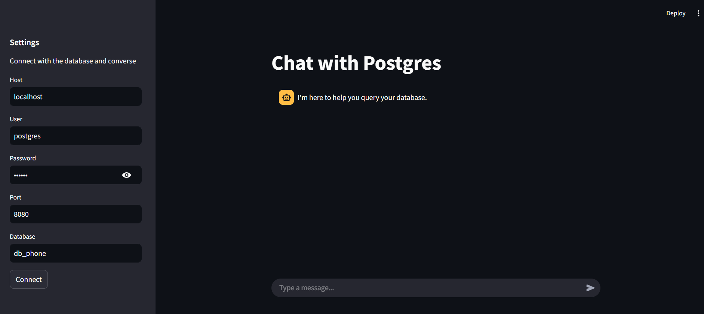
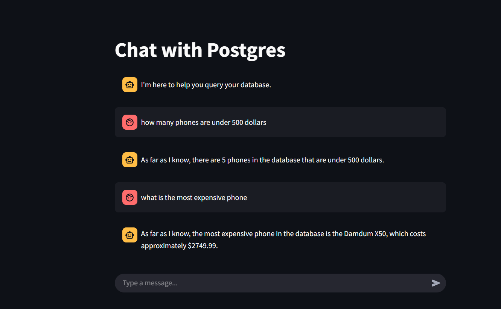

# SQLMind 
&nbsp;&nbsp;&nbsp;Online live: [Aiven](https://sqlmind.streamlit.app/) <br/>
&nbsp;&nbsp;&nbsp;&<br/>
&nbsp;&nbsp;&nbsp;Local demo: [local](https://sigiiz-sqlmind.hf.space/)<br/>

SQLMind is an intelligent SQL chatbot that converts natural language questions into SQL queries and provides human-readable responses. It leverages LangChain, Groq-powered LLMs, and Streamlit for an interactive web-based experience.
<hr />
Notice: <br/>
Bot running harmful queries is to be addressed.
<hr />
The local implementation of the project will be provided below while: <br />

### [Hosted](https://sqlmind.streamlit.app/): <br />

&nbsp;&nbsp;&nbsp;The hosted stremlit app contains [Aiven](https://aiven.io/) postgres database of the same locally hosted database. The dbdamdum has tbl_phones <br />

The local implementation is in [Implementation](#implementation) made using Huggingface-Spaces and hosted from it.

## Features

- **Supports Multiple LLMs**: Gemma 2, Mixtral, Llama 3.2.
- **Interactive UI**: Two-column layout:
  - Left: PostgreSQL credential input.
  - Right: Conversational interface.
- **Automated Query Generation**: Converts user questions into SQL queries.
- **Natural Language Responses**: Provides readable answers based on SQL results.
- **Streaming Support**: Responses are streamed for better user experience.
- **Modular Design**: Uses prompting, runnables, and chaining for efficient query processing.

## Technologies Used

- **Python** (3.11+)
- **LangChain** (for LLM-based query and response generation)
- **Groq** (for LLM execution)
- **Streamlit** (for web-based UI)
- **PostgreSQL** (as the database backend)

## Installation

### Prerequisites

- Ensure you have Python 3.11 installed.
- Install PostgreSQL and set up a database.

### Install Dependencies

```sh
pip install -r requirements.txt
```

Or, you can use install.txt file to view the libraries used.

## Configuration

Ensure your PostgreSQL credentials are set up correctly in the UI before starting a conversation. My credentials are available there too. Donot exhaust these resources.

## Running the Web App

Start the Streamlit app using:

```sh
streamlit run app.py
```

## Database Design

This project is a miniature part of my chatbot project for a mobile phone company website to understand how ai,chatbot and agents can be used for real life applications.<br />
&nbsp;&nbsp;&nbsp;The database is a knock-off for exisitng mobile phone comapny. Mobile phones have a lot of specs which makes it go-to idea for frontend and database based projects. More complex relationships will be added later.

## Database Structure
The databse file can be found as [dataEntry.sql](./dataEntry.sql)
```
damdum_server/
└── db_phone/
    └── tbl_phones/
        ├── Columns:
        │   ├── id (Primary Key, UUID)
        │   ├── brand (Text)
        │   ├── model (Text)
        │   ├── release_date (Date)
        │   ├── price (Numeric)
        │   ├── processor (Text)
        │   ├── ram (Integer, in GB)
        │   ├── storage (Integer, in GB)
        │   ├── battery_capacity (Integer, in mAh)
        │   ├── display_size (Numeric, in inches)
        │   ├── display_type (Text, e.g., AMOLED, LCD)
        │   ├── camera_main (Text, MP & details)
        │   ├── camera_front (Text, MP & details)
        │   ├── os (Text, e.g., Android, Damdum UI)
        │   ├── network (Text, e.g., 5G, LTE)
        │   ├── weight (Numeric, in grams)
        │   ├── dimensions (Text, LxWxH in mm)
        │   └── color_options (Text, comma-separated)
        └── Rows: 50
```

## <a id="implementation">Implementation:</a>

1. The Main Screen:
   
2. After Establishing Connection:
   
3. Conversation
   

## Author

Developed by [Vishal Sigdel](https://github.com/Page-Vishal)
